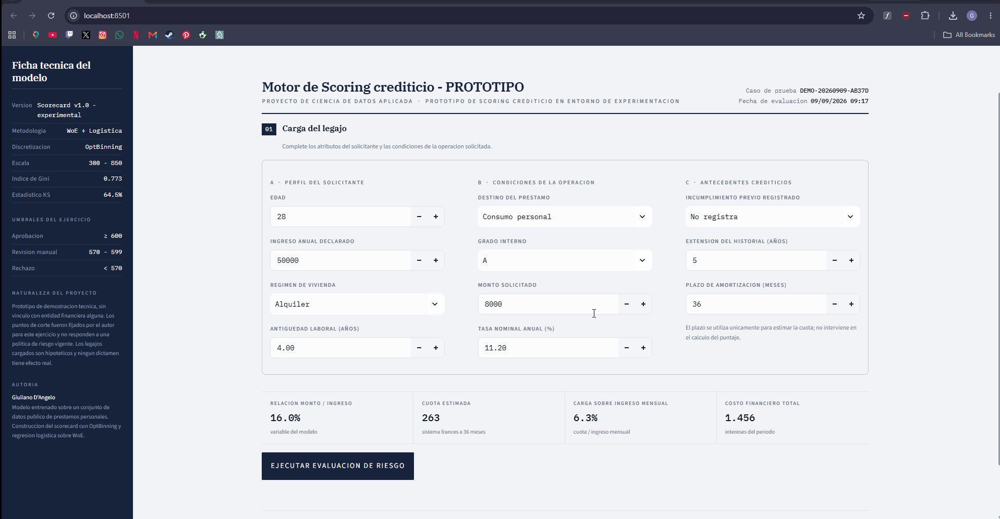

# Credit Risk Scorecard


Modelo de *credit scoring* end-to-end sobre una escala 300–850, desde el
binning óptimo de las variables hasta una aplicación de evaluación de
solicitantes con generación de reporte en PDF.

**Gini:** 0.772 (train) · 0.773 (test) · brecha −0.001
**KS (test):** 64.5%

El binning óptimo y la regresión logística se ajustan **exclusivamente sobre el conjunto de entrenamiento** (70%), y todas las métricas se miden sobre el 30% restante, que el modelo nunca vio. La brecha train–test de 0.001 en Gini indica ausencia de sobreajuste, algo que se espera en un modelo sencillo como el de kaggle 
 
El análisis de punto de corte y la segmentación por bandas de riesgo también se calculan sobre el conjunto de prueba, de modo que el *bad rate* reportado en cada tramo es practicamente una estmiación sin muestra.

<!-- Reemplazar por una captura real de la app -->


---

## Contenido

| Ruta | Descripción |
|---|---|
| `app.py` | Aplicación Streamlit: evaluación de solicitantes, motor de decisión y export a PDF. |
| `src/train.py` | Pipeline de entrenamiento: binning, regresión logística sobre WOE y construcción del scorecard. |
| `notebooks/scorecard_analysis.ipynb` | Análisis exploratorio, tablas de binning, validación y análisis de punto de corte. |
| `models/scorecard_model.pkl` | Artefacto serializado (binning process + scorecard + cortes + métricas). |
| `outputs/Scorecard_Credito_Puntos.csv` | Tabla de puntos del scorecard, por variable y por bin. |

---

## Metodología

1. **Datos.** `credit-risk-dataset` (Kaggle), ~32k solicitudes con 11 variables
   de perfil, empleo y características del préstamo. Target: `loan_status`
   (1 = default).
2. **Partición.** *Train / test* estratificado 70/30. El binning se ajusta
   **solo sobre train** para evitar filtración del target hacia el conjunto de
   validación.
3. **Binning óptimo (WOE/IV).** `BinningProcess` de OptBinning discretiza
   variables numéricas y categóricas maximizando el poder predictivo,
   preservando monotonicidad e interpretabilidad. El IV se usa como criterio
   de relevancia de cada variable.
4. **Modelo.** Regresión logística sobre las variables transformadas a WOE:
   estándar de la industria por trazabilidad y explicabilidad regulatoria.
5. **Escalado.** El log-odds se lleva a una escala 300–850 (`min_max`),
   comparable a la convención de mercado tipo FICO.
6. **Validación.** Gini y KS sobre test; distribución del score por clase y
   análisis de estabilidad por banda de riesgo.
7. **Estrategia de admisión.** Barrido de puntos de corte con el trade-off
   entre tasa de aprobación, *bad rate* de la cartera aprobada y
   *bad capture* (mora evitada).

### Bandas de riesgo

| Banda | Rango de score |
|---|---|
| A — Muy bajo | 720 – 850 |
| B — Bajo | 640 – 719 |
| C — Medio | 570 – 639 |
| D — Alto | 500 – 569 |
| E — Muy alto | 300 – 499 |

### Política de decisión

| Score | Decisión |
|---|---|
| ≥ 600 | Aprobado |
| 530 – 599 | Revisión manual |
| < 530 | Rechazado |

---

## Instalación

Requiere **Python 3.12**.

```bash
git clone https://github.com/Acoless/credit-risk-scorecard.git
cd credit-risk-scorecard

python -m venv .venv
.venv\Scripts\activate          # Windows
# source .venv/bin/activate     # Linux / macOS

pip install -r requirements.txt
```

## Uso

Ejecutar la aplicación:

```bash
streamlit run app.py
```

Reentrenar el modelo desde cero (descarga el dataset vía `kagglehub` y
regenera `models/scorecard_model.pkl`):

```bash
pip install -r requirements-dev.txt
python src/train.py
```

---

## Limitaciones

- El dataset es estático y no permite validación *out-of-time*, necesaria para
  medir estabilidad poblacional (PSI) en un entorno productivo.
- No se aplicó corrección por *reject inference*: el modelo aprende únicamente
  del comportamiento de solicitudes ya otorgadas.

---
```text
credit-risk-scorecard/
├── README.md
├── LICENSE                          # MIT
├── .gitignore
├── requirements.txt                 # correr la app
├── requirements-dev.txt             # reentrenar (kaggle, matplotlib, jupyter)
├── app.py
├── run.bat
├── .streamlit/
│   └── config.toml                  
├── src/
│   └── train.py
├── notebooks/
│   └── script.ipynb     
├── models/
│   └── scorecard_model.pkl
├── outputs/
│   └── Scorecard_Credito_Puntos.csv
└── docs/docs/
    ├── app_preview.png              
    ├── app_preview2.png
    ├── Informe_DEMO-20260909-662D0.pdf
    └── Proyect.gif

```
## Stack

Python 3.12 · pandas · scikit-learn · OptBinning · SciPy · Streamlit · FPDF2

## Autor

**Giuliano D'Angelo** — Estudiante de Lic. en Economía (UBA)
[LinkedIn](https://www.linkedin.com/in/giulianodangelo/) · [GitHub](https://github.com/Acoless)

## Licencia

MIT — ver [LICENSE](LICENSE).
